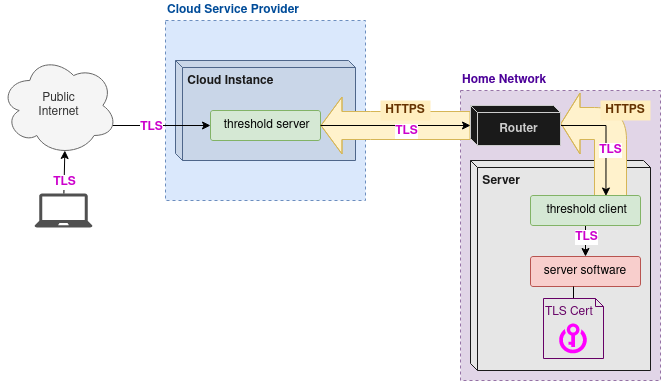

## threshold 🏔️⛰️🛤️⛰️🏔️

Threshold was created to make self-hosting websites, email, and other services radically easier.

Threshold implements a public-internet-facing gateway (TCP reverse tunnel & SOCKS5 forward proxy) for self-hosted servers. 

The [greenhouse cloud service](https://git.sequentialread.com/forest/greenhouse) was developed in order to make threshold more easily accessible to more people. Greenhouse operates the server side of threshold as a service, charging $0.01 per GB of bandwidth.


Threshold server is designed to be a **relatively untrusted** service, in other words, the user doesn't need to place much trust in the environment where the server runs. It's designed so that the server operator can't spy on you. This makes it uniquely suited to bridge the "ownership vs capability" gap between a self-hosted server/homelab/datacenter and a 3rd-party public cloud environment, hence the name threshold. 

This project was originally forked from https://github.com/koding/tunnel

This repository only includes the application that does the tunneling part.  It does not include any other management or automation tools.

See the usage example folder for a basic test.



This diagram was created with https://app.diagrams.net/.
To edit it, download the <a download href="readme/diagram.drawio">diagram file</a> and edit it with the https://app.diagrams.net/ web application, or you may run the application from [source](https://github.com/jgraph/drawio) if you wish.


### How it is intended to be used:

1. An automated tool creates a cloud instance and installs and configures the threshold server on it. 
1. An automated tool installs the threshold client on the self-hoster's server computer. 
1. An automated tool calls the `PUT /tunnels` api on the threshold server's Management Port, and sends a JSON file describing which ports should be opened on the threshold server, which client they should be tunneled to, and which service on the client they should be tunneled to, as well as whether or not the HAProxy "PROXY" protocol should be used. This connection can use TLS Client Authentication.
1. The threshold client connects to the threshold server on the Tunnel Control Port. This connection can use TLS Client Authentication. This connection will be held open and re-created if dropped.
1. An internet user connects to the threshold server on one of the ports defined in the JSON. The internet user's request is tunneled through the original connection from the threshold client, and then proxied to the web server software running on the self-hoster's server computer.
1. (OPTIONAL) The server operator installs software (for example, email server) which requires outgoing requests to "come from" the same IP address that the server is listening for connections at.
1. The email server or other software connects to the threshold client for SOCKS5 forward proxy. The threshold client forwards this connection through the existing tunnel connection to the threshold server (secured by TLS), then the threshold server handles the SOCKS5 connection and proxies it to the destination requested by the email server or other software. 


### Output from Usage example showing how it works:

```
Starting the tunnel server with tunnel mux port: 9056, management port: 9057 

Starting the "listener" test app. It listens on port 9001.  This would be your web  application server.

2020/08/06 14:00:03 threshold server is starting up using config:
{
  "DebugLog": false,
  "TunnelControlPort": 9056,
  "ManagementPort": 9057,
  "CaCertificateFile": "InternalCA+chain.crt",
  "ServerTlsKeyFile": "localhost.key",
  "ServerTlsCertificateFile": "localhost+chain.crt"
}
Listener: I am listening on port 9001
2020/08/06 14:00:03 runServer(): the server should be running now
Starting the tunnel client.  Client Identifier: TestClient1

2020/08/06 14:00:04 theshold client is starting up using config:
{
  "DebugLog": false,
  "ClientId": "TestClient1",
  "ServerHost": "localhost",
  "ServerTunnelControlPort": 9056,
  "ServerManagementPort": 9057,
  "ServiceToLocalAddrMap": {
    "fooService": "127.0.0.1:9001"
  },
  "CaCertificateFile": "InternalCA+chain.crt",
  "ClientTlsKeyFile": "TestClient1@example.com.key",
  "ClientTlsCertificateFile": "TestClient1@example.com+chain.crt"
}
runClient(): the client should be running now
Checking the list of connected clients.
HTTP GET localhost:9057/clients:
{"TestClient1":{"CurrentState":"ClientConnected","LastState":"ClientUnknown"}}

Sending the tunnel configuration to the server.
HTTP PUT localhost:9057/tunnels:
now listening on 127.0.0.1:9000

[{"HaProxyProxyProtocol":true,"ListenAddress":"127.0.0.1","ListenHostnameGlob":"*","ListenPort":9000,"BackEndService":"fooService","ClientId":"TestClient1"}]

Starting the "sender" test app. 
It connects to the front end port of the tunnel (port 9000).  This would be your end user who wants to use the web application.

Sender: I am dialing localhost:9000 from 127.0.0.1:59382
Sender: sent 16 bytes
Listener: Someone connected from: 127.0.0.1:59382
Listener: read 16 bytes
Listener: the sender sent: Hello ! Hello! 

Listener: I am going to respond with "asd"
Listener: conn.Close()
Sender: read 3 bytes
Sender: Response from listener was: asd
Done. Now terminating forked processes and cleaning up.. 
```

Note how the listener sees the original source IP and port, not the source IP and port of the connection from the tunnel client, because the listener supports the PROXY protocol and reports the source ip and port it recieves that way.

### Why did you set it up this way?

I have a few requirements for this system. 

* It should be 100% automatable. It is intended to be used in a situation where it is unreasonable to ask the user to perform any sort of advanced manual configuration. 
* Users have control over their own data.  We do not entrust cloud providers or 3rd parties with our data, even those who are hosting our threshold server. TLS keys/certificates, security-relevant configurations, etc only exist on the user-controlled computer. The cloud provider doesn't get access to any information or capability beyond what the user's ISP (Internet Service Provider) would normally have.
  * If the cloud provider wants to launch a Man in the Middle attack against the threshold user, they will run into the same problems that an ISP would.
* It should support Failover/High Avaliability of services.  Therefore, it needs to be able to have multiple tunnel clients connected at once, which can be hot-swapped via a management API.

### What did you add on top of the koding/tunnel package?

* A command line application which can be run in client mode or server mode based on a JSON config file. 
  * Optional TLS with Client Authentication
  * management API:
    * GET /clients
    * PUT /tunnnels
* Simplicity and Laser-like focus on "opaque" usage of TCP. Removed HTTP/WebSocket/old Virtual Hosts code.
* Added support for HAProxy "PROXY" protocol. 
* Added support for port mappings between front end and back end. 
* Introduced concept of a "service" string instead of port number, so the client decides what ports to connect to, not the server. 
* Added support TLS SNI based virtual hosts. (Hostname based routing)
* Fixed various bugs related to connection lifecycle.
* Added a tunneled SOCKS5 proxy to support applications like email servers which need to be able to dial out from the same IP address that they recieve connections at.

### How to build

```
go build -o threshold
```

### How to build the docker image:

```
./build-docker.sh
```
